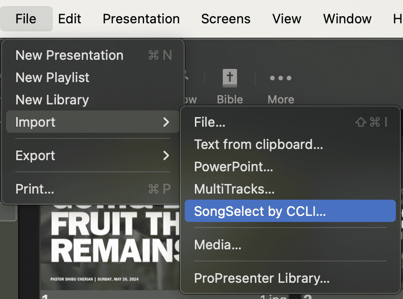
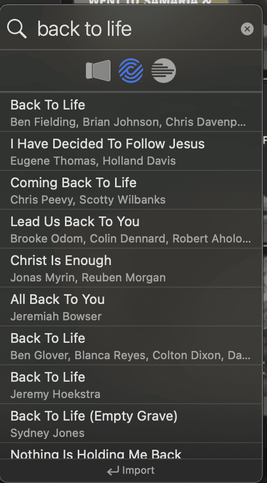
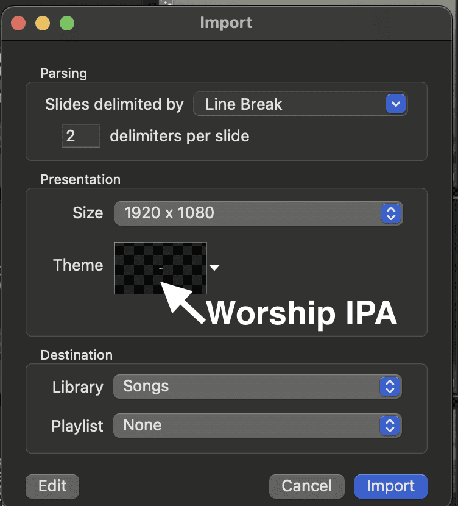
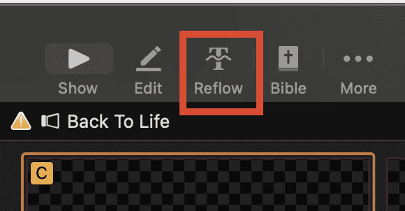
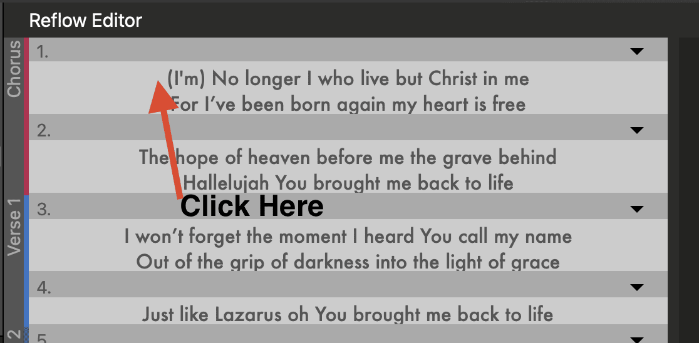
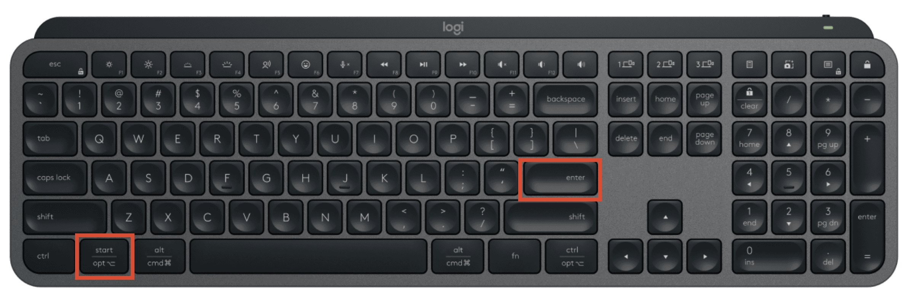
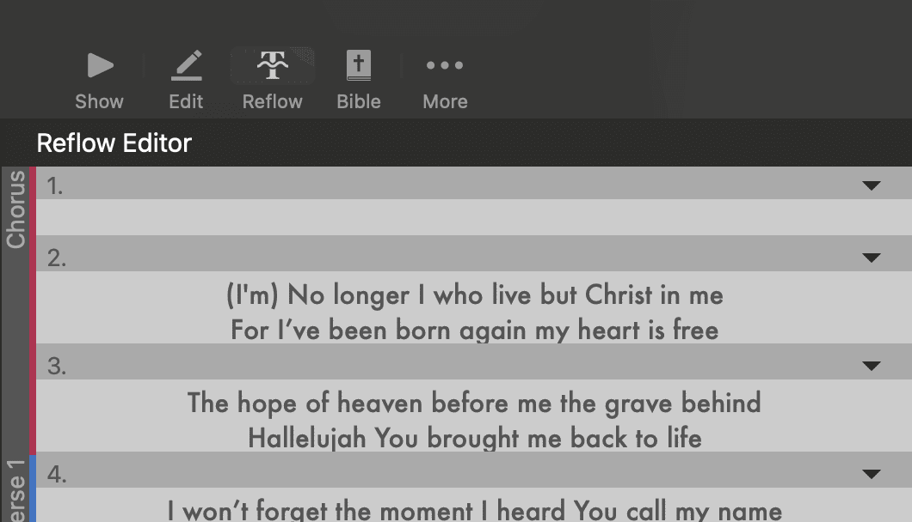
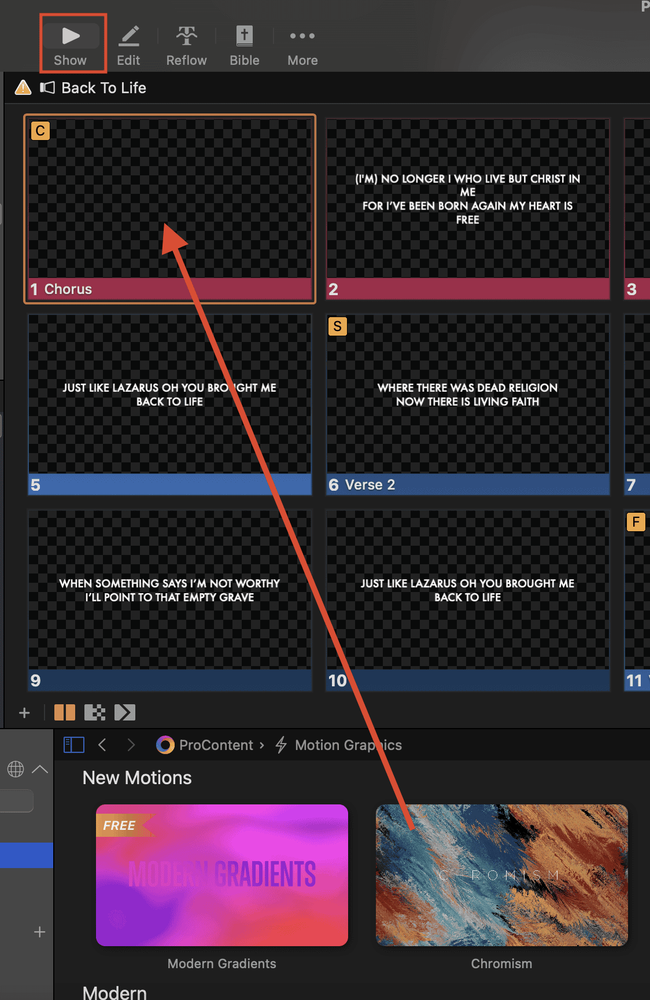

# Adding Songs to ProPresenter

This guide walks you through importing a song from CCLI SongSelect directly into ProPresenter and getting it ready for Sunday.

## Importing the Song

1. Click the **SongSelect by CCLI** button in the toolbar, or go to **File > Import > SongSelect by CCLI**.
   

2. A SongSelect search window will open. Type the song title or a portion of the lyrics into the search bar and press **Enter**.
   

3. Browse the results and click on the correct song to preview it.

4. Once you've confirmed it's the right song, click **Import**.
   

## Formatting the Slides

After importing, the lyrics may all appear on a single slide or need to be broken up. Use the **Reflow Editor** to fix this:

5. Click **Reflow** in the toolbar to open the Reflow Editor. This view lets you see all the lyrics as continuous text and set where each slide break should go.
   

6. Click at the point in the text where you want a new slide to begin.
   

7. Press and hold **Option**, then press **Enter** to insert a slide break at that point.
   

8. Repeat steps 6–7 until the lyrics are divided into natural sections (verse, chorus, bridge, etc.).
   

## Adding a Background

9. Click **Show** to enter the live output view, then drag a background video or image from the media library onto the song. Match the background to the tempo and feel of the song.
   

The song is now imported, formatted, and ready to add to your Sunday playlist.

> **Tip:** If the song isn't available on SongSelect, you can create a new presentation manually in ProPresenter and type the lyrics in directly.
