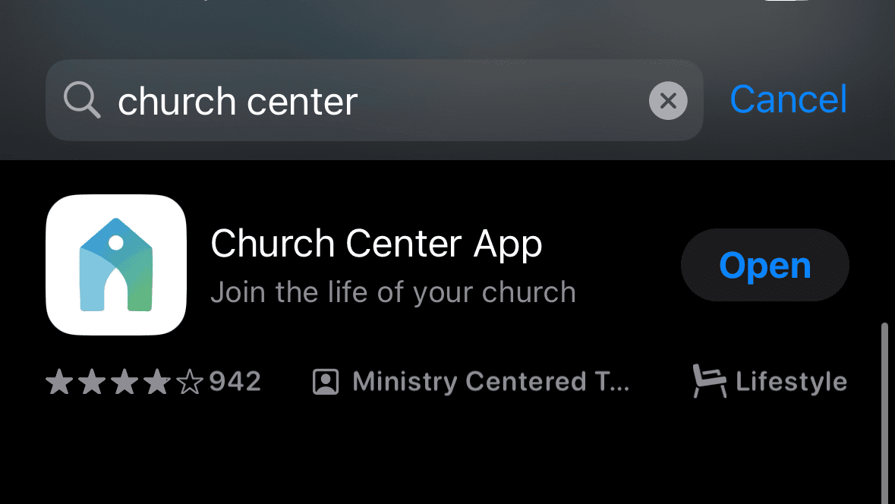
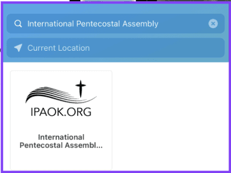
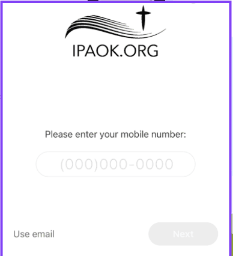
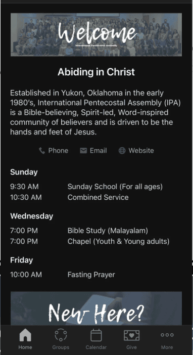
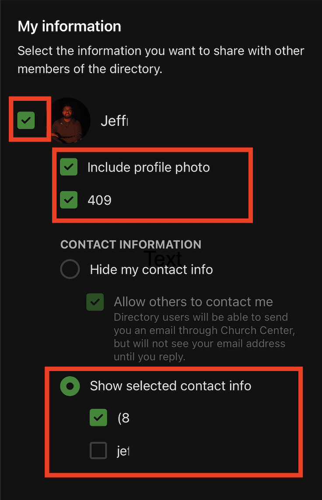
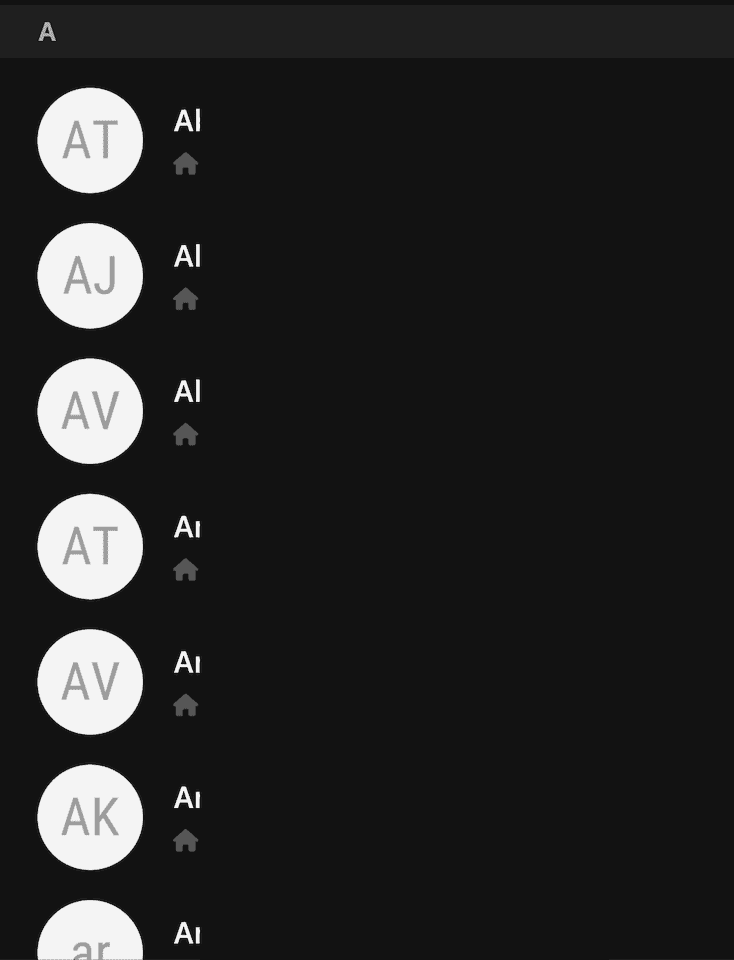

# Church Center App Setup Guide

> Welcome to International Pentecostal Assembly! To stay connected with our church community and access all our resources, we encourage you to download and set up the Church Center app. Follow the steps below to get started.

## Step 1: Download the App

**iPhone**
1. Open the **App Store**.
2. Search for **Church Center**.
3. Tap **Get** to download and install the app.

**Android**
1. Open the **Google Play Store**.
2. Search for **Church Center**.
3. Tap **Install** and wait for it to finish.

## Step 2: Open the App

1. Open Church Center after it installs.
2. If prompted, allow location access — this helps you find International Pentecostal Assembly more easily.

## Step 3: Find and Connect to IPA

1. On the home screen, tap **Get Started**.
2. When asked to find your church, type **International Pentecostal Assembly** or enter our zip code **73099**.
   
3. Tap on **International Pentecostal Assembly** in the search results and verify the church info.
4. Tap **This is my church** to confirm.

## Step 4: Log In

1. Enter the phone number or email address associated with your IPA profile.
2. You'll receive a login code by text or email — enter it to sign in.

> If you don't have an account yet or run into trouble, reach out to [media@ipaok.org](mailto:media@ipaok.org) and we'll get you set up.

## Step 5: Explore the App

Once you're in, here's what you'll find:

- **Home** — Featured content and important links.
- **Give** — Securely give tithes and offerings (also available via Zelle).
- **Events** — Browse and register for upcoming gatherings.
- **Groups** — Join small groups or ministries.
- **Announcements** — Stay up to date with what's happening at IPA.

## Step 6: Turn On Notifications

Enable push notifications so you don't miss event reminders, updates, or important announcements from church leadership.

---

## Sharing Your Directory Information

The Church Center directory is only visible to church members and is manually maintained by our team. Here's how to share your information:

1. Go to the **Directory** tab in Church Center.
   
2. You'll be prompted to share your info — tap **Share Now**. If you don't see this prompt, contact admin or the media director.
   
3. Review your name, profile photo, address, and phone number.
   
4. Tap **Share** to publish your info to the church directory.
   
5. You're done — your information is now visible to other church members.
   

---

## Need Help?

If you run into any issues, contact the media team at [media@ipaok.org](mailto:media@ipaok.org) or reach out to media leadership directly.
