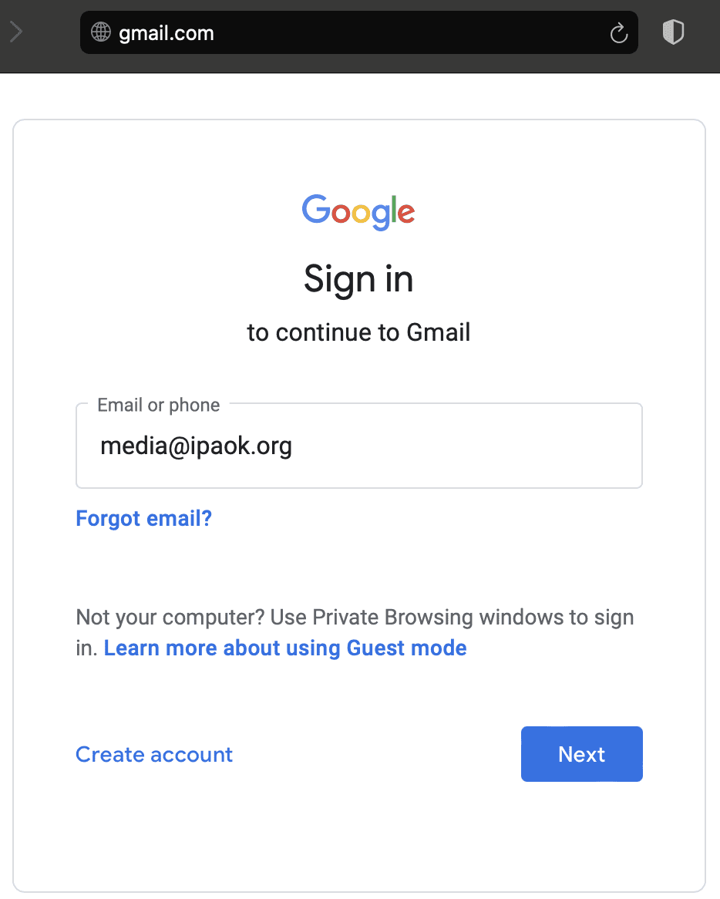
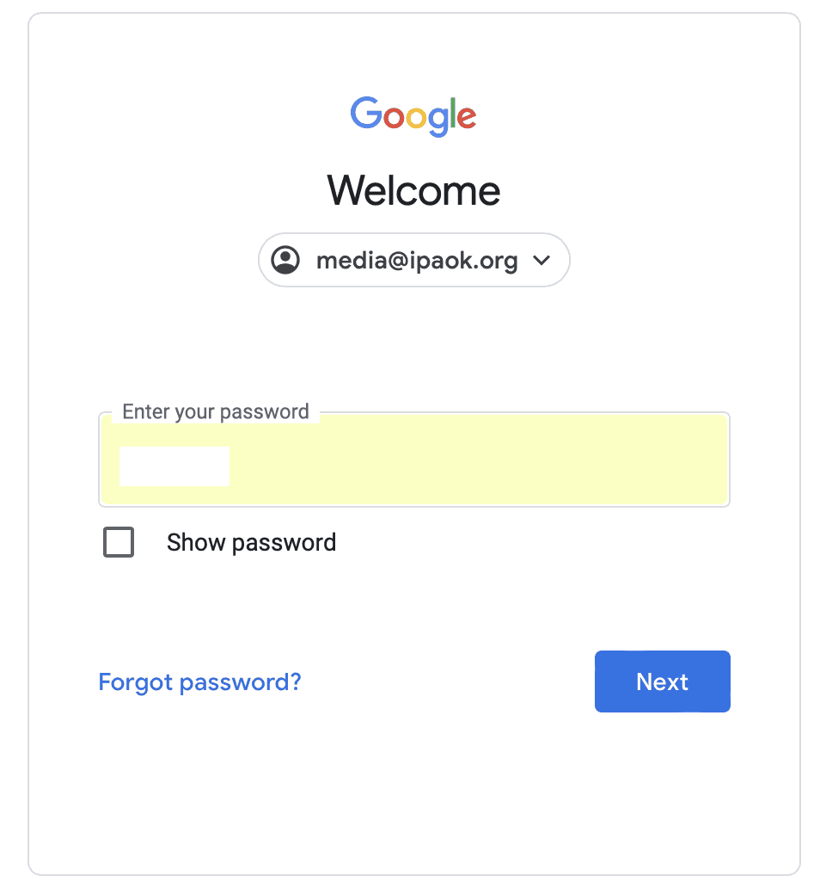
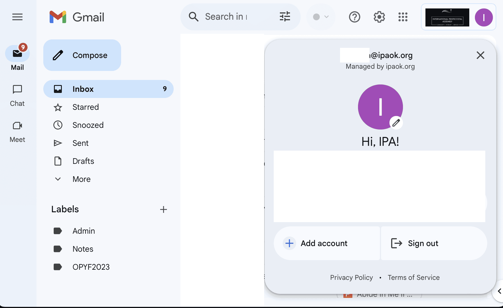
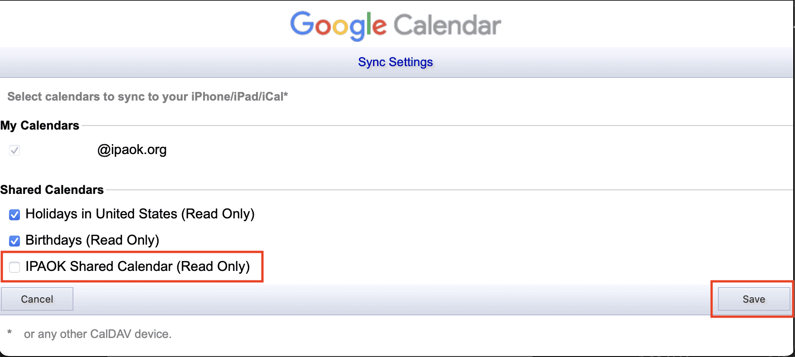

# IPA Email Guide

IPA staff and volunteers use Google Workspace for email and shared calendars. Your email address follows the format `boardposition@ipaok.org` and should have been provided to you when you joined your team.

---

## Logging In

1. Open your web browser and go to [gmail.com](https://gmail.com) or [mail.google.com](https://mail.google.com).

2. Enter your full IPA email address (e.g., `boardposition@ipaok.org`) and click **Next**.
   

3. Enter your password. Passwords are case-sensitive, so type carefully. Click **Next** to sign in.
   

4. You'll land in your Gmail inbox. From here you can also access other Google Workspace apps (Calendar, Drive, Docs, etc.) using the grid icon in the top-right corner.
   

> If you have trouble logging in, email [techdirector@ipaok.org](mailto:techdirector@ipaok.org) for help.

---

## Enabling the IPA Shared Calendar on iPhone

**The problem:** You can see the IPA Shared Calendar on your computer, but it doesn't show up in the Calendar app on your iPhone.

**Why this happens:** iOS requires you to explicitly enable syncing for shared Google calendars — it doesn't happen automatically.

**How to fix it:**

1. On your iPhone, open **Safari** and go to:
   [https://calendar.google.com/calendar/syncselect](https://calendar.google.com/calendar/syncselect)

2. Sign in to your IPA Google account if prompted.

3. You'll see a list of all calendars linked to your account. Scroll to find the **IPAOK Shared Calendar**.
   

4. Check the box next to the IPAOK Shared Calendar to enable sync, then tap **Save**.

5. Exit Safari and open the built-in **Calendar** app on your iPhone.

6. Tap **Calendars** at the bottom of the screen and confirm the IPAOK Shared Calendar is listed and checked. If it's there but unchecked, tap it to enable it.

7. The shared calendar's events will now appear alongside your personal calendar.
