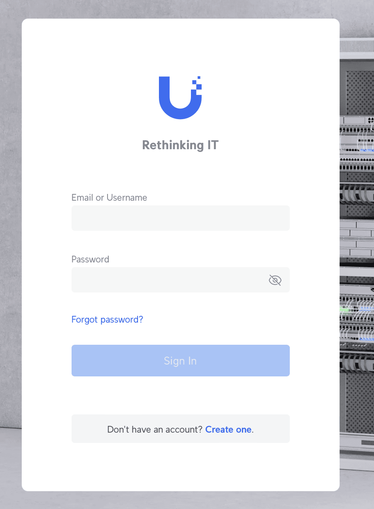
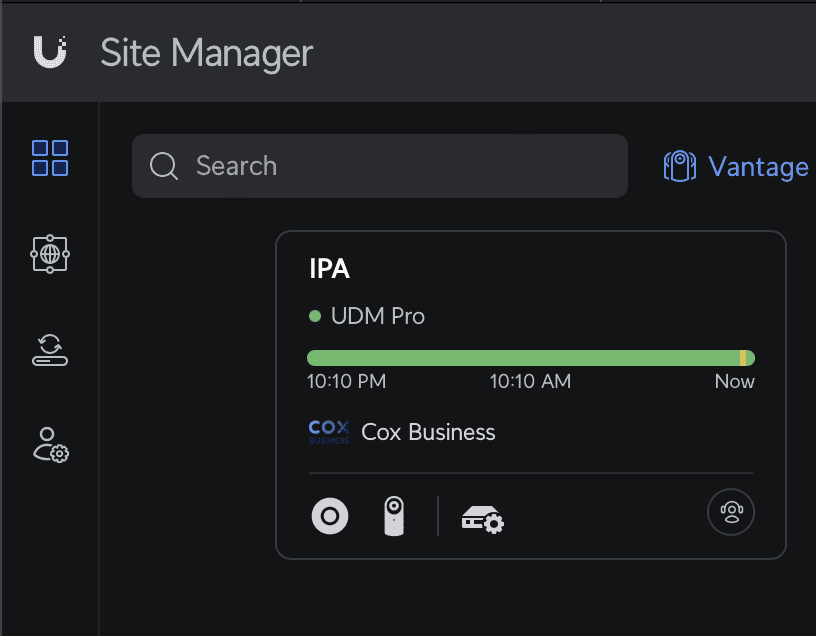
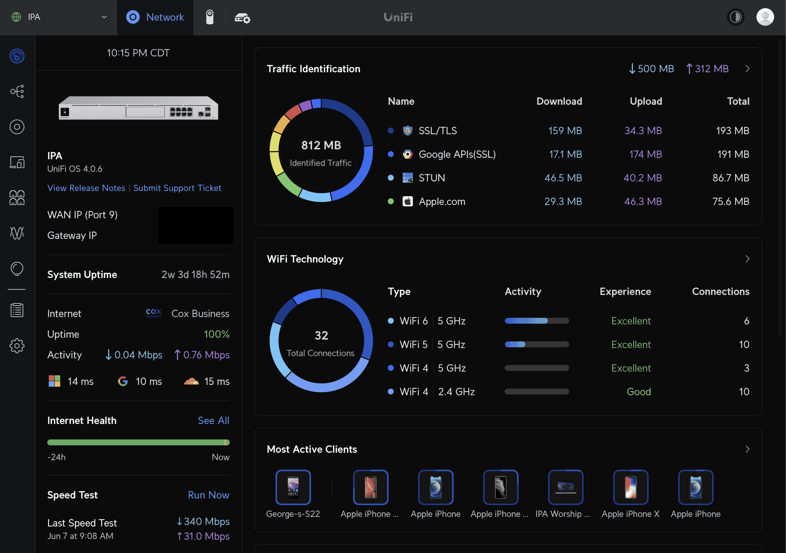

# Networking Guide

IPA uses **Ubiquiti UniFi** networking gear for all our Wi-Fi and internet infrastructure. UniFi gives us centralized control over the entire network — letting us manage performance, security, and device access across all our facilities from a single dashboard.

---

## Key Concepts

If you're new to networking, here are the terms you'll encounter most often.

### Subnet

A subnet (short for "subnetwork") is a segment of a larger network. Dividing a network into subnets improves performance, security, and organization by keeping different types of traffic separate.

- Each subnet has a defined range of IP addresses. Devices within the same subnet can talk directly to each other.
- A **subnet mask** defines the size of the subnet — how many IP addresses it can hold.
- **Why we use them:** Subnets let us separate guest devices, staff devices, and IoT devices so they don't interfere with each other.

### VLAN

A VLAN (Virtual Local Area Network) is a logical grouping of devices on the network, regardless of where they're physically connected. VLANs let us create isolated segments without needing separate physical hardware.

- Devices on different VLANs can't communicate with each other unless we explicitly configure a routing rule.
- **Why we use them:** VLANs let us keep the media team's equipment separate from guest devices, improving both security and performance.

### LAN

A LAN (Local Area Network) is a private network that connects devices within a limited area — like a single building. Our church facilities run on a LAN.

- LANs offer high-speed, low-latency connections.
- Not directly accessible from the internet without additional security measures.

### WAN

A WAN (Wide Area Network) connects LANs across larger geographic distances — like our internet connection to the outside world. Our ISP provides the WAN link that connects our LAN to the internet.

### Firewall

A firewall monitors all traffic entering and leaving the network and blocks or allows it based on predefined rules.

- **Allow rules** — Permit specific types of traffic (e.g., web browsing, streaming).
- **Deny rules** — Block traffic that shouldn't be allowed (e.g., unauthorized access attempts).
- Our UniFi setup uses the built-in firewall to protect the network and enforce rules between VLANs.

---

## Our Network Layout

### VLANs

| VLAN | Purpose | Notes |
|------|---------|-------|
| **Default** | Unused — break-glass only | No devices should connect to this network |
| **IPA Guest** | General access for members and guests | Speed limited to 100/5 Mbps |
| **IPA IoT** | Thermostats and smart devices | Speed limited to 100/5 Mbps |
| **IPA Media** | Media team devices (IPA-owned) | No speed restrictions; access is restricted — requires approval |

### Subnets

| Network | Subnet | Available Hosts |
|---------|--------|----------------|
| Default (unused) | 192.168.1.0/24 | 254 |
| IPA Guest | 192.168.4.0/24 | 254 |
| IPA IoT | 192.168.2.0/24 | 254 |
| IPA Media | 192.168.3.0/24 | 254 |

### Wi-Fi Networks

| Network Name | Who It's For |
|---|---|
| **IPA-Guest** | Members, guests, and general visitors |
| **IPA-IoT** | Thermostats and other smart/IoT devices |
| **IPA-Media** | IPA-owned media team devices only — access requires media director approval |

---

## FAQs

**Why is the Guest and IoT network speed limited to 100/5 Mbps?**

Our total internet capacity is 300/30 Mbps. We reserve 15–20 Mbps of upload specifically for the live stream. Without these limits, a guest's device uploading a large file could starve the live stream of bandwidth — which has caused outages in the past. Limiting guest and IoT speeds ensures the stream stays stable.

**Why do we use /24 subnets instead of something larger?**

We don't expect more than 254 devices on any one network segment, and given our limited upload capacity, keeping device counts manageable ensures everyone gets a reliable connection. The table below shows how subnet sizes compare:

| CIDR | Subnet Mask | Hosts Available |
|------|-------------|-----------------|
| /16 | 255.255.0.0 | 65,534 |
| /17 | 255.255.128.0 | 32,766 |
| /18 | 255.255.192.0 | 16,382 |
| /19 | 255.255.224.0 | 8,190 |
| /20 | 255.255.240.0 | 4,094 |
| /21 | 255.255.248.0 | 2,046 |
| /22 | 255.255.252.0 | 1,022 |
| /23 | 255.255.254.0 | 510 |
| /24 | 255.255.255.0 | **254** |
| /25 | 255.255.255.128 | 126 |
| /26 | 255.255.255.192 | 62 |

---

## Accessing the UniFi Portal

1. Go to [https://unifi.ui.com](https://unifi.ui.com).
   

2. Log in with your username and password, then click on **IPA**.
   

3. You're in. The dashboard gives you an overview of all connected devices, network health, and traffic.
   

> Access to the UniFi portal is limited to the networking team and media director. If you need access, submit a request to the media director.
